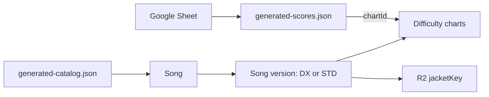

# Data model

This is the central reference for data stored by the score gallery. The
corresponding compile-time definitions live in `src/utils/types.ts`.



## Score archive

`src/data/generated-scores.json` is the append-only public score archive.

```ts
interface ScoresResponse {
  updatedAt: string; // ISO 8601 timestamp of the last archive change
  scores: ScoreRecord[];
}

interface ScoreRecord {
  id: string;                  // Stable play identifier
  chartId: string;             // Stable Chart ID assigned before commit
  playedAt: string;            // ISO 8601 capture time
  songTitle: string;           // Title reported by OCR / spreadsheet
  chartType: "DX" | "STD";
  difficulty: "BASIC" | "ADVANCED" | "EXPERT" | "MASTER" | "Re:MASTER";
  level: string;               // Display level, e.g. "13+"
  chartConstant?: number;
  achievement: number;         // Percentage on a 0–101 scale
  combo: string;
  sync: string;
  rating: number;
  ratingChange: number;
  fast: number | null;         // null when timing counts are unavailable
  slow: number | null;
  judgments: JudgmentSet | null; // null when no overall counts are known
  judgmentsByType: JudgmentBreakdown | null;
}

interface JudgmentSet {
  criticalPerfect: number;
  perfect: number;
  great: number;
  good: number;
  miss: number;
}

interface JudgmentBreakdown {
  break: JudgmentSet;
  tap: JudgmentSet;
  hold: JudgmentSet;
  slide: JudgmentSet;
  touch: JudgmentSet;
}
```

Rank is derived in the frontend from `achievement`; it is not stored on each score record.

Notes/Location is intentionally excluded from the public archive.

## Song catalog

`src/data/generated-catalog.json` stores normalized song metadata. Each song
owns one or more DX/STD versions, and each version owns its difficulty charts.

```ts
interface GeneratedCatalog {
  generatedAt: string;
  songs: Song[];
}

interface Song {
  id: string;                   // e.g. "magical-flavor"
  titles: SongTitles;
  artist: string;               // Artist credit from the SEGA catalog
  jacketKey: string | null;     // R2 object key, never credentials or a full URL
  versions: SongVersion[];
}

interface SongTitles {
  canonical: string;
  kana: string[];
  romaji: string[];
  english: string[];
  aliases: string[];
}

interface SongVersion {
  id: string;                   // e.g. "magical-flavor-dx"
  chartType: "DX" | "STD";
  charts: Chart[];
}

interface Chart {
  id: string;                   // e.g. "magical-flavor-dx-master"
  difficulty: "BASIC" | "ADVANCED" | "EXPERT" | "MASTER" | "Re:MASTER";
  level: string;
  chartConstant: number | null;
}
```

The browser derives `jacketUrl` at build time from `VITE_JACKET_BASE_URL` and
the stored `jacketKey`. It is not part of the persisted catalog schema.

## Rejected song names

Scores whose song titles remain unmatched are quarantined before commit. The
metadata workflow uploads `.sync/rejected-scores.json` as a temporary GitHub
Actions artifact containing the rejected title and affected score IDs/times.
They are not stored in either generated data file. Correct the spreadsheet title
or add an override, then rerun the score archive workflow to retry them.

## Matching and identity rules

- Every committed score references a stable `Chart.id`; title/type/difficulty
  remain as readable source data.
- Song-version IDs end in `-dx` or `-std`.
- Chart IDs append the normalized difficulty to the song-version ID.
- DX and STD versions share their parent song's immutable `jacketKey`.
- Search titles exist only in `Song.titles`, never on score records.
- Kana, romaji, English titles, and aliases are trimmed and normalized to
  lowercase during catalog import.
- `chartConstant: null` means the source has no constant and no override exists.

## Enforcement

`src/utils/data-validation.ts` validates both generated JSON files at runtime. The
same validation runs in catalog synchronization and GitHub Pages deployment
through `npm run data:validate`; invalid data stops the workflow before commit
or deployment.
