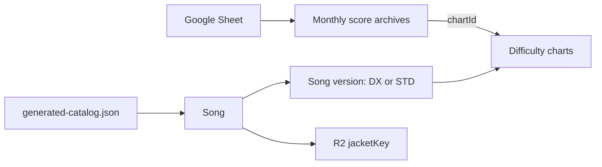

# Data model

This is the central reference for data stored by the score gallery. All data structures are currently stored in JSON 
files rather than a database, which gives me extra flexibility at the project's current scale. Keeping everything in JSON 
makes the data easy to inspect and lets me change the schema or fix entry errors as requirements evolve. 
If this project eventually grows beyond personal use, I would move toward database-backed models with proper keys, 
constraints, and indexing.

The authoritative app definitions live in [`src/utils/types.ts`](../src/utils/types.ts).
The index below covers every exported type; field definitions stay in that file
so this document does not maintain a second copy of the schema. Import and
maintenance instructions live in [Operations](operations.md).

| Area | Types in `src/utils/types.ts` |
| --- | --- |
| Shared values | `Difficulty`, `ChartType`, `ComboStatus`, `SyncStatus` |
| Stored catalog | `GeneratedCatalog`, `Song`, `SongTitles`, `MaimaiVersion`, `SongVersion`, `Chart` |
| Stored plays | `ScoreChunk`, `ScoreRecord`, `JudgmentSet`, `JudgmentBreakdown`; `Score` aliases `ScoreRecord` |
| Stored chart records | `ChartSummaries`, `ChartRecordSummary`, `BestAchievement`, `BestStatus` |
| Frontend catalog views | `CatalogSongView`, `CatalogChartView` |
| Frontend song lists | `SongSummary`, `SongChartSummary` |
| Derived rank and rating | `AchievementRank`, `PlayRatingInput` |

## Score archive

`src/data/scores/YYYY-MM.json` files form the public score archive. Plays are
partitioned by the UTC month of `playedAt`; an unchanged month is not rewritten. Synchronization adds new play identities,
updates matching identities from the sheet, and collapses duplicate archived
identities. It retains archived plays absent from the sheet; deleting a sheet
row or changing its identity fields does not remove the old archived play.

`src/data/scores/chart-summaries.json` contains the lightweight cumulative
records for each played chart, keyed by `Chart.id` in `ChartSummaries.charts`. Its achievement, combo, and
sync bests are selected independently and point back to their source plays.
The normal import pipeline regenerates it once, after catalog synchronization
has assigned final chart IDs. Archive maintenance must also invoke `npm run scores:summarize`. Local catalog
synchronization does not regenerate summaries by itself.

`bestAchievement` is always present for a summarized chart. `bestCombo` and
`bestSync` are nullable when no play has a corresponding status. Their
`BestStatus` values use `ComboStatus` and `SyncStatus`, respectively.
`historyChunks` is a sorted, unique list of UTC archive months. Charts without
plays have no summary entry. The file's `generatedAt` changes only when its
chart records change.

Bests are selected independently by achievement, combo order
(`FC` < `FC+` < `AP` < `AP+`), or sync order
(`Sync` < `FS` < `FS+` < `FDX` < `FDX+`). Ties prefer higher achievement,
then later `playedAt`, then lexicographically greater score ID.

`ScoreRecord.achievement` is a percentage on the 0–101 scale. `rating` records
the player's rating at capture time, and `ratingChange` records its change;
neither is the calculated rating contribution of that chart. The optional
score `chartConstant` is separate from the nullable catalog chart constant.
`fast`, `slow`, overall `judgments`, and `judgmentsByType` can be null when
unavailable. Missing timing counts are not assumed to be zero.

`criticalPerfect: null` means that the value was not separately displayed or
could not be read. Older result layouts combine CRITICAL PERFECT and PERFECT
for TAP, HOLD, SLIDE, and TOUCH, so those legacy note types retain the combined
count in `perfect` and store `criticalPerfect: null`. BREAK continues to store
its separately displayed critical-perfect count. A numeric zero is reserved
for a count that was actually shown as zero.

Combo is stored as `FC`, `FC+`, `AP`, `AP+`, or null. The importer derives it
from achievement and judgments: 101% gives AP+; otherwise a miss prevents full
combo, all perfect judgments give AP, no goods gives FC+, and other plays with
no misses give FC. Without judgments, a non-101% imported play cannot establish
a combo. Sync is `Sync`, `FS`, `FS+`, `FDX`, `FDX+`, or null; full-sync import
statuses require a derived full combo. When reading existing main-sheet rows,
the loader can fall back to the stored Combo Status if judgments are unavailable;
new image and manual imports have no such fallback.

Rank is derived in the frontend from `achievement`; it is not stored on each score record.
The gallery groups all achievement values below 80% under `Failed`.

The current history UI displays overall judgments and Fast/Slow counts, not
`judgmentsByType`. Timestamps are stored in UTC and displayed in US Eastern Time. Image imports
prefer embedded EXIF, then Drive image metadata, but fall back to Drive
`createdTime` (upload time) when neither is available. A review correction can
override the selected time; the public archive does not retain its source.

Notes/Location is intentionally excluded from the public archive.

## Song catalog

`src/data/generated-catalog.json` stores normalized song metadata. Each song
owns one or more DX/STD versions, and each version owns its difficulty charts.
`Song` owns the shared `jacketKey`, artist, genre, introduction, and search titles.
`Chart` includes both nullable `chartConstant` and nullable `charter` fields.
Supplemental metadata refreshes constants and charter names for existing charts;
non-null manual overrides take precedence, and existing values are retained
when supplemental values are unavailable. See [song overrides](operations.md#song-overrides)
for the editable override format, which differs from the generated catalog.

`introducedIn` deliberately differs from `versions`: `introducedIn` is the
named game release in which SEGA associates the song, while `versions` contains
the song's playable DX/STD chart variants. The numeric code is retained because
its trailing digits identify SEGA content batches within a release family.
A standalone song can have `introducedIn: null` when its release is unknown.

The importer maps the observed SEGA ranges as follows:

| Codes | Release | Codes | Release |
| --- | --- | --- | --- |
| 10000–10999 | maimai | 11000–11999 | maimai PLUS |
| 12000–12999 | GreeN | 13000–13999 | GreeN PLUS |
| 14000–14999 | ORANGE | 15000–15999 | ORANGE PLUS |
| 16000–16999 | PiNK | 17000–17999 | PiNK PLUS |
| 18000–18499 | MURASAKi | 18500–18999 | MURASAKi PLUS |
| 19000–19499 | MiLK | 19500–19899 | MiLK PLUS |
| 19900–19999 | FiNALE | 20000–20499 | maimai でらっくす |
| 20500–20999 | maimai でらっくす PLUS | 21000–21499 | Splash |
| 21500–21999 | Splash PLUS | 22000–22499 | UNiVERSE |
| 22500–22999 | UNiVERSE PLUS | 23000–23499 | FESTiVAL |
| 23500–23999 | FESTiVAL PLUS | 24000–24499 | BUDDiES |
| 24500–24999 | BUDDiES PLUS | 25000–25499 | PRiSM |
| 25500–25999 | PRiSM PLUS | 26000–26499 | CiRCLE |
| 26500–26999 | CiRCLE PLUS | | |

The ranges are derived by correlating the numeric `version` values in
[SEGA's public song catalog](https://maimai.sega.jp/data/maimai_songs.json)
with the documented chronological [maimai release list](https://en.wikipedia.org/wiki/Maimai_(video_game_series)#Versions).
An unknown future range fails validation so it cannot be silently assigned to
the wrong release. A standalone override can provide a verified release name
with `code: null` when its exact historical SEGA batch code is unavailable.

The browser derives `jacketUrl` using the build-time configuration from `VITE_JACKET_BASE_URL` and
the stored `jacketKey`. It is not part of the persisted catalog schema.

## Frontend structures

`CatalogSongView` combines parent song metadata with one `SongVersion`; its `id`
is the version ID and its `charts` belong to that DX/STD version. It adds
`jacketUrl`, which is null when the base URL or object key is missing.
`CatalogChartView` pairs that song view with a `Chart` for chart-ID lookup.

`SongSummary` groups titles, chart type, optional jacket URL, and
`SongChartSummary` entries for the score list. Each chart summary has a chart
ID, difficulty, chart type, and level, with optional constant and achievement.
Missing achievement means the chart has no recorded result in that view.
These list summaries are constructed from eagerly loaded scores and catalog
metadata matched by title and chart type, rather than from the persisted chart
summaries. Chart detail pages instead look up catalog metadata by `chartId`
and read cumulative bests from chart summaries. The list structures are distinct from the persisted `ChartRecordSummary` best-status records.

`AchievementRank` describes the display rank returned by
[`achievementRank`](../src/utils/rank.ts). `PlayRatingInput` contains achievement,
a nullable chart constant, and optional combo for
[`calculatePlayRating`](../src/utils/rating.ts). That function calculates a
CiRCLE/CiRCLE PLUS chart contribution, returning null without a constant.
Chart details combine best achievement and best combo, including the AP/AP+
bonus; the calculated value currently appears in the desktop information card.
This does not recalculate captured player ratings or implement the Top 50 page.
These views and calculated values are not additional archive files.

## Rejected song names

Scores whose song titles remain unmatched are quarantined before commit. The
metadata workflow uploads `.sync/rejected-scores.json` as a temporary GitHub
Actions artifact containing the rejected title and affected score IDs/times.
The report contains `generatedAt`, `rejectedSongs` (each with `title` and
`scores` containing `id` and `playedAt`).
Rejected plays are excluded from committed score archives. Correct the
spreadsheet title or add an override, then rerun **Import New Scores** to retry
them. This temporary report is produced by the catalog script, not an app type.

## Matching and identity rules

- Every committed score references a stable `Chart.id`; title/type/difficulty
  remain as readable source data.
- Song-version IDs end in `-dx` or `-std`.
- Chart IDs append the normalized difficulty to the song-version ID.
- DX and STD versions share their parent song's `jacketKey`.
- Search titles exist only in `Song.titles`, never on score records.
- Kana, romaji, English titles, and aliases are trimmed and normalized to
  lowercase during catalog import.
- `Chart.chartConstant: null` means no constant is available from overrides,
  supplemental metadata, or a retained existing value.

## Enforcement

[`src/utils/data-validation.ts`](../src/utils/data-validation.ts) parses the
generated catalog, monthly score chunks, and chart summaries for the app.
[`scripts/validate-data.mjs`](../scripts/validate-data.mjs) uses those parsers and
also checks release-code/name consistency and that chart summaries exactly
match records rebuilt from the archive.

The import workflow runs `npm run data:validate:source` after catalog sync,
then regenerates summaries and runs `npm run data:validate` before committing.
Deployment runs full validation before building. TypeScript describes the
compile-time shapes; these runtime checks enforce data constraints.

Validation is not exhaustive: the archive parsers do not check that every
`chartId` exists in the catalog, enforce all numeric ranges/count integrality,
or repeat import-time judgment arithmetic and combo derivation. Catalog linking
and score import perform additional checks, so a passing `data:validate` alone
is not proof that arbitrary hand-edited records satisfy every semantic rule.
