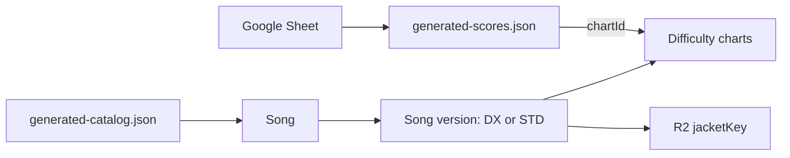

# Data model

This is the central reference for data stored by the score gallery. The
corresponding compile-time definitions live in `src/types.ts`.



## Score archive

`src/data/generated-scores.json` is the append-only public score archive.

```ts
interface ScoresResponse {
  updatedAt: string; // ISO 8601 timestamp of the last archive change
  scores: ScoreRecord[];
}

interface ScoreRecord {
  id: string;                  // Stable play identifier
  chartId: string | null;      // Stable Chart ID; null only while unmatched
  playedAt: string;            // ISO 8601 capture time
  songTitle: string;           // Title reported by OCR / spreadsheet
  chartType: "DX" | "STD";
  difficulty: "BASIC" | "ADVANCED" | "EXPERT" | "MASTER" | "Re:MASTER";
  level: string;               // Display level, e.g. "13+"
  chartConstant?: number;
  achievement: number;         // Percentage on a 0–101 scale
  rank: string;
  combo: string;
  sync: string;
  rating: number;
  ratingChange: number;
  fast: number;
  slow: number;
  judgments: JudgmentSet;
  judgmentsByType: JudgmentBreakdown | null;
}

interface JudgmentSet {
  criticalPerfect: number;
  perfect: number;
  great: number;
  good: number;
  miss: number;
}

interface JudgmentBreakdown {
  break: JudgmentSet;
  tap: JudgmentSet;
  hold: JudgmentSet;
  slide: JudgmentSet;
  touch: JudgmentSet;
}
```

Notes/Location is intentionally excluded from the public archive.

## Song catalog

`src/data/generated-catalog.json` stores normalized song metadata. Each song
owns one or more DX/STD versions, and each version owns its difficulty charts.

```ts
interface GeneratedCatalog {
  generatedAt: string;
  songs: Song[];
  unmatchedSongs: UnmatchedSong[];
}

interface Song {
  id: string;                   // e.g. "magical-flavor"
  title: string;                // Canonical SEGA title
  alternateTitles: string[];    // Romaji, translations, or remembered names
  jacketKey: string | null;     // R2 object key, never credentials or a full URL
  versions: SongVersion[];
}

interface SongVersion {
  id: string;                   // e.g. "magical-flavor-dx"
  chartType: "DX" | "STD";
  charts: Chart[];
}

interface Chart {
  id: string;                   // e.g. "magical-flavor-dx-master"
  difficulty: "BASIC" | "ADVANCED" | "EXPERT" | "MASTER" | "Re:MASTER";
  level: string;
  chartConstant: number | null;
}
```

The browser derives `jacketUrl` at build time from `VITE_JACKET_BASE_URL` and
the stored `jacketKey`. It is not part of the persisted catalog schema.

## Unmatched songs

Titles absent from SEGA's catalog are retained so they are not fetched every
week.

```ts
interface UnmatchedSong {
  title: string;
  reason: string;
  firstSeenAt: string;
  lastAttemptedAt: string;
}
```

Add the unmatched title to the correct entry's `alternateTitles` in
`catalog/overrides.json` to retry it.

## Matching and identity rules

- A score references a stable `Chart.id`; title/type/difficulty are retained as
  source data and as a fallback while a song is unmatched.
- Song-version IDs end in `-dx` or `-std`.
- Chart IDs append the normalized difficulty to the song-version ID.
- DX and STD versions share their parent song's immutable `jacketKey`.
- Alternate titles exist only on `Song`. Spreadsheet aliases pass between sync
  jobs as a temporary artifact and merge additively without entering score JSON.
- Alternate titles are trimmed and normalized to lowercase during import.
- `chartConstant: null` means the source has no constant and no override exists.
- Seed titles in `catalog/seed-titles.json` request metadata before scores exist.

## Enforcement

`src/data-validation.ts` validates both generated JSON files at runtime. The
same validation runs in catalog synchronization and GitHub Pages deployment
through `npm run data:validate`; invalid data stops the workflow before commit
or deployment.
